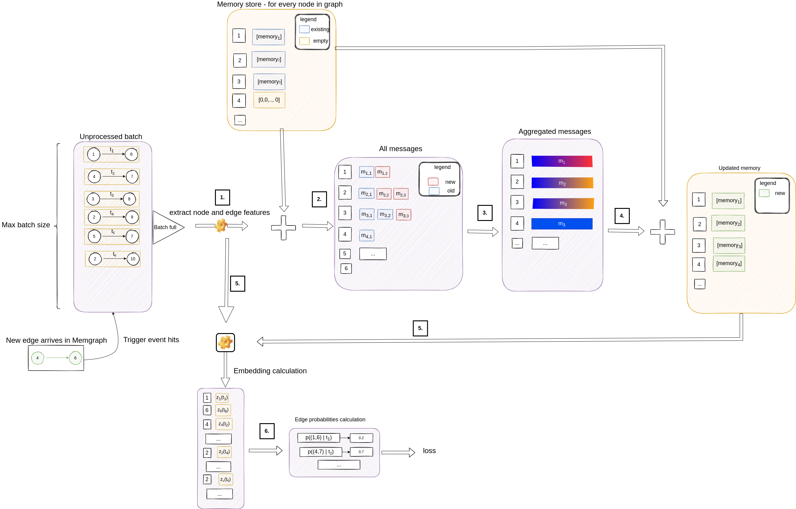
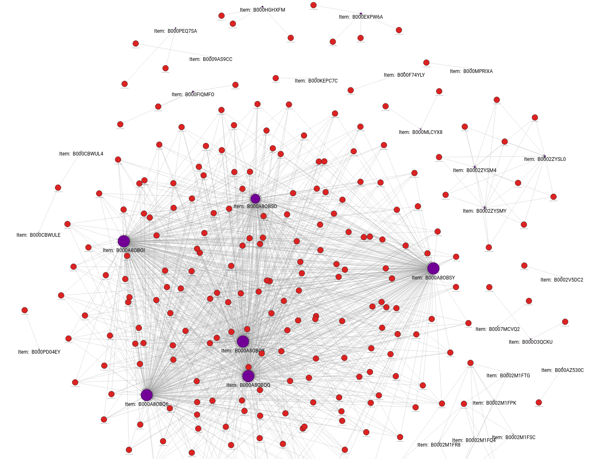
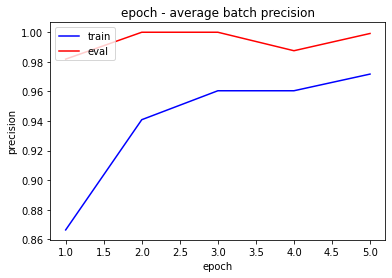

#PyTorch x Amazon product reviews = :heart:

Purpose of this  **Jupyter Notebook** is to make it easy to start **exploring and learning**
about **Temporal Graph Networks** and **GNNs** as part of **Memgraph** and in general.


## Table of contents
 * [Introduction to repo](#introduction)
 * [What are Graph Neural Networks and TGN](#what-are-gnns)
 * [Dataset visualized](#dataset-visualized)
 * [About Amazon product dataset](#about-dataset)
 * [Setup](#setup)
 * [Learning materials](#learning-materials)

##Introduction
This directory is an example of how to use **[Temporal Graph Networks](https://memgraph.com/docs/mage/query-modules/python/tgn)** for the
link prediction on **[Amazon product graph](http://snap.stanford.edu/data/amazon/productGraph/)** dataset.

In this Jupyter Notebook  we run **[Memgraph](https://memgraph.com/docs/memgraph/)** inside 
**[Docker](https://www.docker.com/)** and use **[GQLAlchemy](https://memgraph.com/docs/gqlalchemy/)** as a link between 
Graph Database objects and Python objects. To start you will need **Docker** and you will need to download 
**Docker image** of **[Memgraph Platform](https://memgraph.com/download)**


## What are GNNs
**Graph neural networks** present a neural network models dealing with convolutions over graphs. It all started
with **[Graph convolutional networks](https://arxiv.org/abs/1609.02907)** and idea of researchers to start exploring signals on graphs.
Actually those ideas started way before with [spectral clustering](https://arxiv.org/pdf/0711.0189.pdf), 
but after several years of research and polishing signal exploration over graph, **graph neural networks** were born.
Afterwards, **GNNs** expanded and started adapting **inductive** learning methods, which helped with development of
**[graph neural networks](https://towardsdatascience.com/temporal-graph-networks-ab8f327f2efe)** on dynamic graphs. This
specific model is called **Temporal Graph Networks(TGN)**.

Here is a schematic view of how **TGN** works:


As you can see process works with batch processing. In this image, we presented how the edge prediction task works
with **interaction events** as the main building block of **TGN**. Interaction event is another name for edge creation
between two nodes. After a batch is full we extract features from nodes and edges. From those features and old memory, we 
create a **message** for each of **interaction events**. Actually, from one interaction event, we create **two** messages, one
for *source node* and the other for *destination node* of the edge. In step 3 we aggregate messages for each node. In a batch 
of messages, we have some old messages from nodes that already had interaction events in a graph. In our example, we use
a message aggregator that is in the research paper called **last**. We only take **last** message and it represents aggregated messages.
Other options include **mean** or **LSTM**. Now, memory needs to be updated from new aggregated messages and old memory.
The final step includes embedding calculation from updated memory and *node and edge* features which represent the initial embedding
of nodes. This part of embedding calculation is not an easy task since for every node you need to design different 
**computation graph** for every node since it depends on when did the mentioned node had last interaction, since it cannot
see nodes from feature. To check how we implemented it, jump to [our GitHub site](https://github.com/memgraph/mage).


You can learn more about how **TGN** works from [learning materials](#learning-materials) down below.

## Dataset visualized
We will start exploring **TGN** with our **amazon product** dataset looks. We have used **Memgraph Lab** to create
this visualization. Memgraph Lab comes along with you **Memgraph Platform** and you can create your own styles **[here](https://memgraph.com/docs/memgraph-lab/)**.




## About dataset
All the information about dataset, you can find on the following **[link](http://snap.stanford.edu/data/amazon/productGraph/)**.

From the dataset description: 
```plaintext
This dataset contains product reviews and metadata from Amazon, 
including 143.7 million reviews spanning May 1996 - July 2014.

This dataset includes reviews (ratings, text, helpfulness votes), 
product metadata (descriptions, category information, price, brand, and image features), 
and links (also viewed/also bought graphs).
```

## Setup
1. Firstly, go to **[Stanford page](http://snap.stanford.edu/data/amazon/)** which contains dataset of Amazon product reviews.
2. Pick one of the datasets, download it, extract it and save it inside folder `pytorch_amazon_network_analysis/data/product_reviews.txt`
3. Use script we prepared in `./public/json_converter.py` to create a JSON file from your dataset. 
4. Now use`./public/main.py` to create cypher queries. Now we can start exploring **TGN** as part of **Jupyter Notebook**.
5. Open **Jupyter Lab** and run cells. **Memgraph** should be up and running in order to run successfully all the cells.

## Results visualized
In our experiments we used dataset of around 11500 edges. For that kind of dataset we don't need that many epochs to achieve pretty good results.


## Learning materials
If you wish to start exploring about **TGN** you can read one of the following:
* go to our [page](https://memgraph.com/docs/mage/query-modules/python/tgn) 
* read a paper about **[TGN](https://arxiv.org/pdf/2006.10637.pdf)**
* watch a video explanation about **[TGN](https://www.youtube.com/watch?v=0tw66aTfWaI&t=1s)**
